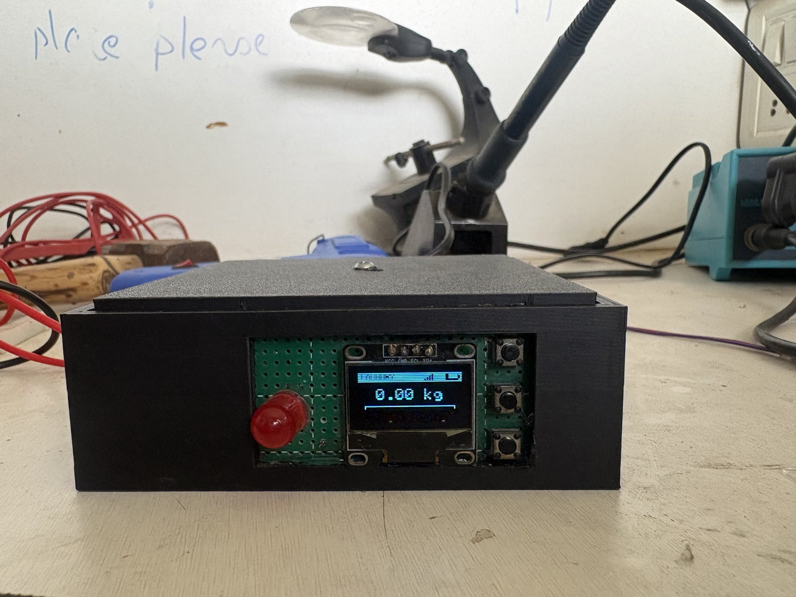

# Smart Laundry Auto-Ordering System

An ESP32-based smart laundry basket that weighs your laundry and automatically sends a pickup order to the laundry manager over Telegram once the basket is full.

> **Status: Phase 1 (working prototype).** The core loop works end to end: weigh, display, auto-order and remind. Planned Phase 2 improvements are listed under [Roadmap](#roadmap-phase-2).

## How It Works

1. **Weighing:** a load cell under the basket, read through an HX711 amplifier, measures the weight of the laundry continuously. Readings are smoothed so the display stays steady but still reacts instantly to large changes.
2. **Display:** a 0.96" SSD1306 OLED shows the live weight, a progress bar towards the target weight, the Wi-Fi signal and the battery level.
3. **Auto-order:** when the weight stays at or above the target (default **5 kg**) for **3 seconds**, the ESP32 sends a pickup request to the laundry manager's Telegram chat:
   ```
   Smart Laundry Alert
   Order ID: #ORD-12345
   Total Weight: 5.12 kg
   Request Time: 04-Oct-2026 06:30 PM
   Pickup Address: <your address>
   ```
   The 3-second hold stops a quick bump or press on the lid from triggering an order.
4. **One order per load:** after an order is sent, the system latches so it doesn't send again. If the basket is still full **24 hours** later, it sends a single `[REMINDER]` message.
5. **Reset:** when the basket is emptied (under 1 kg for 5 seconds), the latch resets, ready for the next load.
6. **Local alert:** a red LED blinks whenever the weight is over the target.

### Boot sequence

On power-up the device shows a splash screen, reconnects to the last Wi-Fi network it joined (12-second timeout), syncs the clock over NTP (IST) so orders carry a real timestamp, then wakes and zeroes the load cell. If Wi-Fi fails, the scale and menu still work offline.

### On-device menu

Press **OK** on the main screen to open the menu. Use **UP/DOWN** to move and **OK** to select.

| Menu item | What it does |
|---|---|
| Tare Scale | Zeroes the scale (empty basket) |
| Set Target | Changes the order threshold in 0.5 kg steps |
| Customer Order | Sends a pickup order manually, with confirmation |
| Calibrate Scale | Two-step calibration: empty the basket and press OK, then place a known weight, set its value with UP/DOWN and press OK. The result is saved to flash |
| Scan WiFi | Scans for nearby networks and connects to the one you pick (see below) |
| Battery Info | Shows the battery percentage |
| Exit Menu | Returns to the main screen |

### Wi-Fi scanning

**Scan WiFi** lists the networks in range. You can connect to:
- any **open** network, or
- any **secured** network whose password is saved in the firmware's `KNOWN_NETWORKS` list.

Secured networks without a saved password are marked with `*`. The ESP32 remembers the last network it joined and reconnects to it on the next boot.

## Engineering Notes

Problems solved while building Phase 1:

- **Wi-Fi start-up resets:** Wi-Fi start-up draws a burst of current that sagged the battery rail and tripped the ESP32's brownout reset. The firmware disables the brownout detector and powers up peripherals in stages.
- **Late HX711 wake-up:** at low supply voltage the HX711 sometimes isn't ready at boot, so it can't be zeroed. The firmware remembers that it still needs zeroing and does it the moment the sensor responds, so a large fake weight never appears.
- **Button-press spikes:** pressing a button on the enclosure physically loads the scale. Weight updates pause for 1.5 seconds after menu actions, so a press can't cause a false reading or an accidental order.
- **Stable readings:** exponential smoothing removes jitter, large changes (basket lifted or loaded) snap through instantly, and anything under 50 g reads as 0.00 kg.
- **Button debouncing:** edge detection plus a 250 ms lockout on each button stops a single press registering twice.

## Hardware

| Component | Purpose |
|---|---|
| ESP32 Dev Board | Main controller, Wi-Fi |
| Load Cell (5/10 kg) + HX711 | Weight sensing |
| 0.96" SSD1306 OLED (I2C) | Live weight and menu UI |
| 3 × Tactile Buttons | UP / OK / DOWN navigation |
| Red LED | Over-target indicator |
| 3.7 V Li-ion + TP4056 (or USB power) | Power |
| 3D-printed enclosure | Designed in Tinkercad (see [`cad/`](cad/)) |

Full pinout and wiring: [`circuit/wiring.md`](circuit/wiring.md). Block diagram: [`circuit/block_diagram.md`](circuit/block_diagram.md).

## Repository Structure

| Folder | Contents |
|---|---|
| [`code/laundry_system/`](code/laundry_system/) | ESP32 firmware (`laundry_system.ino`, `secrets.example.h`) |
| [`circuit/`](circuit/) | Circuit diagram, wiring table, block diagram |
| [`cad/`](cad/) | Enclosure STL files and renders |
| [`photos/`](photos/) | Photos of the build |
| [`videos/`](videos/) | Demo videos |

## Getting Started

1. Wire the components as described in [`circuit/wiring.md`](circuit/wiring.md).
2. In the Arduino IDE, install the libraries **HX711**, **Adafruit SSD1306** and **Adafruit GFX**. (WiFi and HTTPClient come with the ESP32 board package.)
3. In [`code/laundry_system/`](code/laundry_system/), **fill in your own details**:
   - Copy `secrets.example.h` to `secrets.h` and set the Telegram bot token (from @BotFather), the laundry manager's chat ID and the pickup address. `secrets.h` is git-ignored.
   - In `laundry_system.ino`, add your Wi-Fi networks to `KNOWN_NETWORKS`:
     ```cpp
     const KnownNetwork KNOWN_NETWORKS[] = {
       {"YOUR_WIFI_SSID_1", "YOUR_WIFI_PASSWORD_1"},
       {"YOUR_WIFI_SSID_2", "YOUR_WIFI_PASSWORD_2"}
     };
     ```
   > Never commit your real credentials to a public repository.
4. Open `laundry_system.ino` in the Arduino IDE, select your ESP32 board and port, and upload.
5. On the device, use **Scan WiFi** to join a network, then **Calibrate Scale** with a known weight.

## Gallery

### Photos

| | |
|---|---|
| <br>**calibration phase** | <br>**device** |
| <br>**front face** | <br>**side face** |

### Videos

- [connecting to wifi](videos/connecting%20to%20wifi.mp4)
- [custom order](videos/custom%20order.mp4)
- [menu](videos/menu.mp4)
- [weight verification](videos/weight%20verification.mp4)

## Roadmap (Phase 2)

- [ ] Enter Wi-Fi passwords from a phone (captive portal) instead of saving them in the firmware
- [ ] Save the target weight to flash so it survives a reboot
- [ ] Deep sleep with button/timer wake-up for longer battery life
- [ ] Accurate battery measurement through a calibrated voltage divider
- [ ] Two-way Telegram: confirm or cancel an order from the phone
- [ ] Verified TLS for API calls
- [ ] Custom PCB to replace the perfboard

## Author

**Arpan Ailawadi**
B.Tech, Electronics and Communication Engineering, Delhi Technological University
[LinkedIn](https://www.linkedin.com/in/arpan-ailawadi/)
