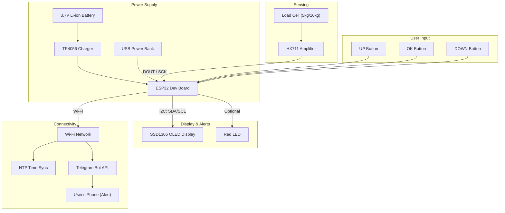

# System Block Diagram

## How it works

1. **Power** — the battery feeds the ESP32 through the TP4056 charger (or USB power directly).
2. **Sensing** — the load cell measures weight, and the HX711 amplifies and digitizes that reading for the ESP32.
3. **Input** — three tactile buttons let the user navigate the on-device menu.
4. **Output** — the ESP32 drives the OLED display for status/menu, and optionally triggers a red LED for local alerts.
5. **Connectivity** — when the weight crosses a threshold, the ESP32 connects to Wi-Fi, syncs time via NTP, and sends a Telegram alert to the user's phone.
